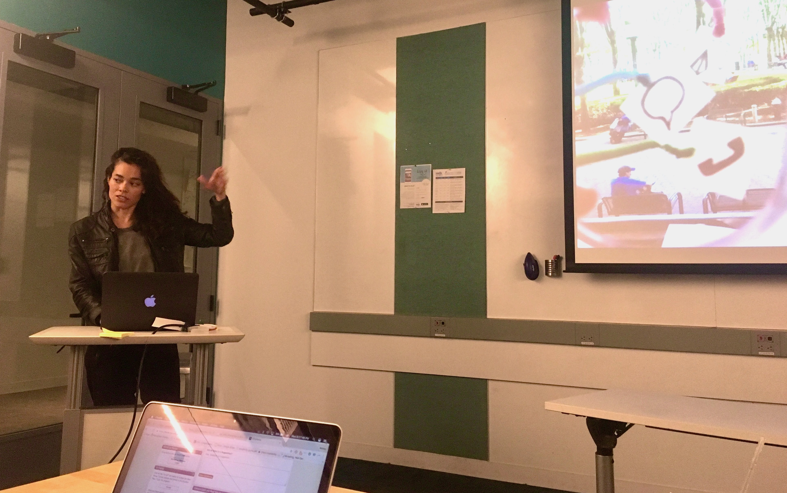

{width=600px}

 

# I scout the future to build innovative digital products 
 
I’m a User Experience (UX) research and design expert focused on incubating early-stage ideas into solutions that add unique value to customers. I enjoy the creative process of collaborating with diverse teams to develop new products from 0 to 1.  

My career journey started in the visual arts, and my passion to create bold visions on a blank canvas has led me to building human-centered products with emerging technologies. I've worn various hats in research, design, and operations in startups, venture capital, and Google.

I received my BA in the Practice of Art from UC Berkeley, and my MS in Integrated Digital Media at NYU Tandon School of Engineering. I’ve presented my research at the ACM CHI Conference on Human Factors in Computing Systems and the CSUN Assistive Technology Conference.
 

My work has concentrated on these research questions:<ul>
- Productivity: What is the future of work? How might we design reliable and intuitive human-AI collaborations?
- Interactions: As digital and physical realities merge, how might we balance user needs in immersion and in context?
- Commercialization: How might we productize breakthrough technologies responsibly in alignment with human values?
</ul>
 

# Let's connect
 
📧 info@shannonholloway.com 
 

☕ Los Angeles, California, USA
